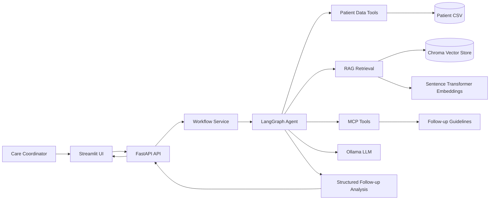
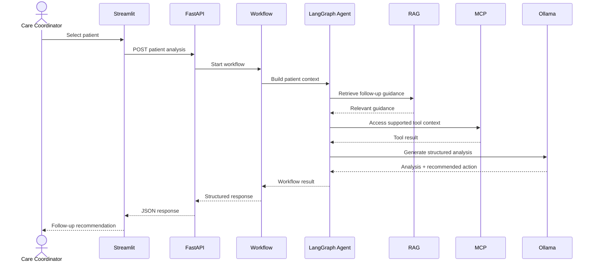

# MediCare Patient Follow-Up Agent

> Production-style healthcare care-coordination decision-support application built from the MediCare Data Scientist interview use case.


## Overview

MediCare Patient Follow-Up Agent converts the original 40-minute notebook-oriented interview exercise into a structured application for patient follow-up and care coordination.

The application reviews patient records, retrieves relevant follow-up guidance, uses an LLM to generate patient-specific analysis, and exposes the workflow through FastAPI and Streamlit.

The system is designed as **decision support for care-coordination teams**. It does not diagnose patients, prescribe treatment, or autonomously change medication.

## Problem Statement

The original use case describes a clinic managing chronic-disease patients where missed appointments and concerning patient-record signals may not be identified until a later visit.

The application addresses two core workflows:

1. Patient analysis
2. Missed-appointment follow-up

The source interview dataset contains 100 anonymised patient records and includes demographics, diagnosis, medication, laboratory results, visit history, appointment status, vitals, and notes.

## Architecture



## Request Flow



## Core Components

| Layer | Responsibility |
|---|---|
| Streamlit | Interactive demonstration UI |
| FastAPI | API and HTTP boundary |
| Workflow service | Coordinates patient-analysis workflows |
| LangGraph | Agent workflow orchestration |
| Ollama | Local LLM inference |
| Chroma | Vector retrieval |
| Sentence Transformers | Embeddings |
| MCP | Tool integration boundary |
| Patient data tools | Patient-record access |
| Evaluation | DeepEval / PromptFoo evaluation assets |
| Testing | Unit and integration tests |
| DevOps | Docker, Jenkins and GitHub Actions configuration |

## Project Structure

```text
medicare-followup-agent/
├── app/
│   ├── api/
│   │   ├── routes/
│   │   ├── schemas/
│   │   ├── error_handlers.py
│   │   └── middleware.py
│   ├── agent/
│   ├── core/
│   ├── llm/
│   ├── mcp/
│   ├── rag/
│   ├── services/
│   ├── tools/
│   ├── ui/
│   └── main.py
├── data/
│   └── patient_data.csv
├── knowledge/
│   └── followup_guidelines.md
├── evaluation/
│   ├── datasets/
│   ├── metrics/
│   └── reports/
├── tests/
│   ├── unit/
│   └── integration/
├── bruno/
├── notebooks/
├── scripts/
├── docker/
├── .github/
│   └── workflows/
├── docs/
│   ├── architecture.mmd
│   └── request-flow.mmd
├── Dockerfile
├── docker-compose.yml
├── Jenkinsfile
├── pyproject.toml
├── uv.lock
└── sonar-project.properties
```

## API Workflows

### Patient Analysis

```http
POST /api/v1/workflows/patients/{patient_id}/analysis
```

### Missed Appointment Follow-Up

```http
POST /api/v1/workflows/patients/{patient_id}/missed-appointment
```

### Health Check

```http
GET /health
```

### Patient Lookup

```http
GET /api/v1/patients/{patient_id}
```

## Error Handling & Observability

The API uses centralized exception handling and request correlation.

Every request receives an `X-Request-ID` response header. Unexpected backend exceptions return a safe client-facing response while backend logs retain the detailed traceback.

Example:

```json
{
  "error": "INTERNAL_SERVER_ERROR",
  "message": "The request could not be completed. Check the backend logs using the request ID.",
  "request_id": "4d6435ee-c178-4eac-a8eac-..."
}
```

This separates internal diagnostics from information exposed to the client.

## Local LLM

Default configuration:

```text
Model: llama3.2:3b
Base URL: http://localhost:11434
Temperature: 0
```

Install/pull the model:

```powershell
ollama pull llama3.2:3b
```

Verify:

```powershell
ollama run llama3.2:3b "Respond with exactly: Ollama is working."
```

## Setup

### Prerequisites

- Python 3.12
- UV
- Ollama
- Git
- Optional: Docker Desktop

### Install

```powershell
git clone <repository-url>
cd medicare-followup-agent
uv sync
```

### Start FastAPI

```powershell
uv run uvicorn app.main:app --host 127.0.0.1 --port 8000
```

### Start Streamlit

Open another terminal:

```powershell
uv run streamlit run app/ui/streamlit_app.py
```

Then open:

```text
http://localhost:8501
```

## Testing

```powershell
uv run ruff check app tests
uv run mypy app
uv run pytest
```

Validated project state:

```text
43 passed
```

## Evaluation

Evaluation assets use:

- DeepEval
- PromptFoo

The evaluation layer assesses response quality and safety characteristics without adding evaluation-only runtime behaviour to every API request.

## Quality & CI

The repository includes configuration for:

- Ruff
- MyPy
- Pytest
- Pytest coverage
- SonarQube
- GitHub Actions
- Jenkins
- Docker

## Docker

```powershell
docker compose up --build
```

Docker execution depends on the Docker engine being installed and running.

## Healthcare Safety Boundary

This application is a **care-coordination decision-support prototype**.

It is intentionally not positioned as:

- a diagnostic system
- a prescribing system
- an autonomous treatment system
- a replacement for clinical judgment

Recommendations should be reviewed by an appropriate human care professional before operational use.

## Original Interview Requirements

The source assessment specifies:

- 100 anonymised patient records
- data loading and exploratory analysis
- agent tools
- an agentic loop
- single-patient analysis
- missed-appointment follow-up
- LLM-based decision generation
- a self-contained runnable submission

This repository implements those core requirements as a broader application architecture while retaining the original patient-data and workflow concepts.

## Development Status

| Area | Status |
|---|---|
| Data layer | Complete |
| FastAPI API | Complete |
| Agent workflow | Complete |
| Local LLM integration | Complete |
| RAG | Complete |
| MCP integration | Complete |
| Patient workflows | Complete |
| Evaluation assets | Complete |
| Error handling | Complete |
| Request logging | Complete |
| Tests | Complete |
| Streamlit demo | Complete |
| Docker/CI configuration | Complete |
| README | Complete |

## License

This repository is intended for educational, interview and demonstration purposes.
